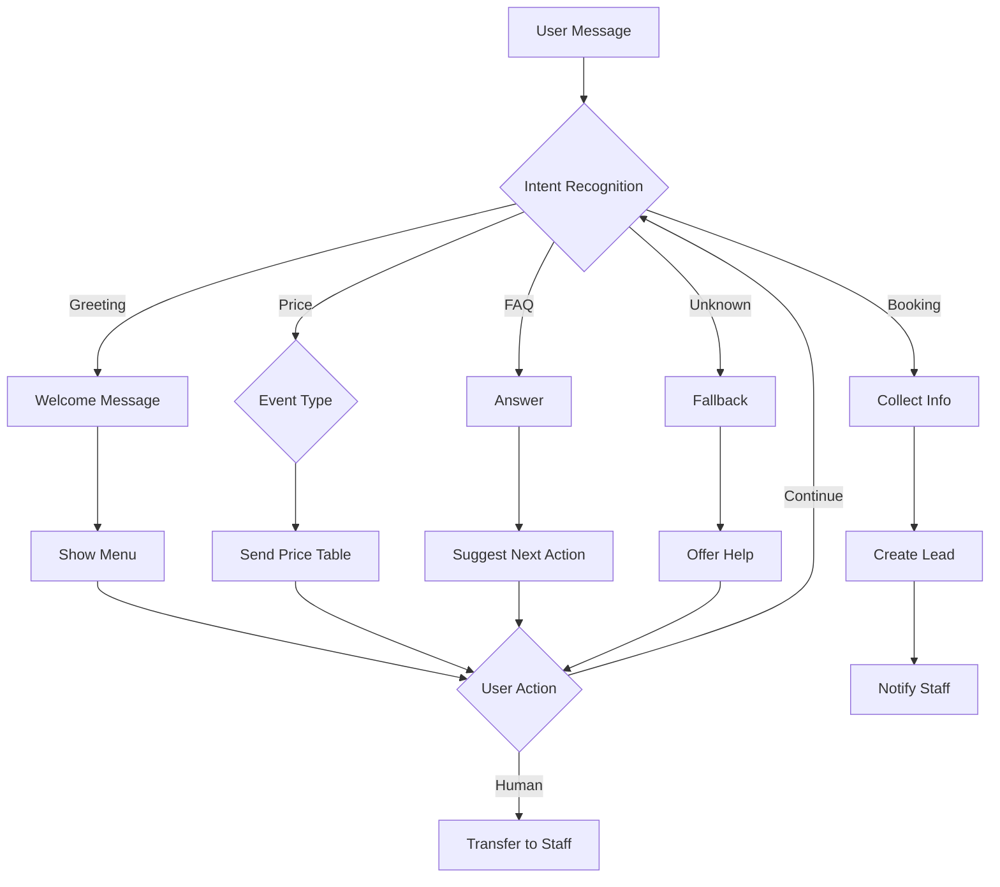

# PHASE 2: XÂY DỰNG CHATBOT TỰ ĐỘNG 24/7
## Sol Cafe Coworking - 181 Trần Quốc Vượng, Cầu Giấy, Hà Nội

---

## CONTEXT LINKS
- [Plan tổng quan](./plan.md)
- [Phase 1: Thiết lập Zalo OA](./phase-01-thiet-lap-zalo-official-account.md)
- [Bảng giá dịch vụ](../../docs/bang-gia-dich-vu-thue-mat-binh-su-kien-sol-cafe-coworking.md)

---

## OVERVIEW

**Priority:** 🔴 HIGH (Critical for automation)

**Current Status:** Pending

**Description:** Xây dựng chatbot tự động để phản hồi khách hàng 24/7, thu thập thông tin, gửi bảng giá, và chuyển nhân viên tư vấn khi cần. Giảm tải cho nhân viên và tăng tốc độ phản hồi.

---

## KEY INSIGHTS

### Tại sao cần Chatbot?

1. **24/7 Availability:** Khách hàng hỏi đêm khuya → Bot trả lời ngay
2. **Consistency:** Tránh sai sót thông tin do nhân viên khác nhau
3. **Data Collection:** Tự động thu thập info khách hàng (tên, SĐT, loại sự kiện)
4. **Cost Effective:** Giảm 60-70% thời gian nhân viên trả lời câu hỏi cơ bản
5. **Lead Qualification:** Lọc khách hàng serious trước khi chuyển cho nhân viên

### Loại Chatbot phù hợp

| Loại | Ưu điểm | Nhược điểm | Khuyên dùng |
|------|---------|------------|-------------|
| **Rule-based** | Dễ setup,成本低 | Không linh hoạt | ✅ Phase 1 |
| **AI-powered** | Thông minh, tự học | Đắt, phức tạp | ❌ Phase 2-3 |
| **Hybrid** | Balance cả hai | Cần dev | ⭐ KHUYẾN NGHỊ |

**Lựa chọn:** **Hybrid Chatbot** (Rule-based + fallback to human)

---

## REQUIREMENTS

### Functional Requirements

1. **Chào mừng tự động:** Gửi welcome message khi khách follow OA
2. **Menu navigation:** Gửi menu lựa chọn (loại sự kiện, bảng giá, đặt lịch)
3. **Bảng giá tự động:** Gửi bảng giá theo loại sự kiện được chọn
4. **Thu thập thông tin:** Họ tên, SĐT, loại sự kiện, ngày, số người
5. **Đặt lịch sơ bộ:** Tạo booking request và notify nhân viên
6. **Chuyển nhân viên:** Khi khách yêu cầu hoặc bot không hiểu
7. **FAQs:** Trả lời câu hỏi thường gặp (địa chỉ, giờ mở cửa, tiện ích...)
8. **Follow-up:** Gửi tin nhắn reminder cho khách chưa phản hồi sau 24h

### Non-Functional Requirements

1. **Response time:** < 2s cho mỗi message
2. **Uptime:** 99.5% availability
3. **Accuracy:** 95%+ correct responses cho FAQs
4. **User-friendly:** UI clear, easy to navigate
5. **Fallback mechanism:** Luôn có option chuyển nhân viên

---

## ARCHITECTURE

### Chatbot Flow Structure

```
User Message
    ↓
[Intent Recognition]
    ↓
    ├─→ Greeting → Welcome Message → Menu
    ├─→ Price Inquiry → Event Type Selection → Price Table
    ├─→ Booking Request → Info Collection → Confirm → Notify Staff
    ├─→ FAQ → Answer → Suggest Next Action
    ├─→ Refund/Cancellation → Policy → Staff Transfer
    └─→ Unknown → Fallback → Offer Staff Transfer
```

### Dialog Tree Design

```
START: Welcome Message
├─ OPTION 1: "1" - Workshop/Training/Lớp học
│   ├─ Show: Giá workshop + Ưu đãi sinh viên
│   ├─ Ask: Bạn muốn đặt lịch hay xem thêm?
│   └─ Loop until clear intent
│
├─ OPTION 2: "2" - Team Building/Họp nhóm
│   ├─ Show: Giá doanh nghiệp + Combo tea break
│   ├─ Ask: Số người dự kiến? (10-20 / 21-30 / 31-50)
│   └─ Show: Báo giá tương ứng
│
├─ OPTION 3: "3" - Sinh nhật/Tiệc riêng
│   ├─ Show: Giá cá nhân + Free trang trí
│   ├─ Ask: Ngày sự kiện? (Check availability)
│   └─ Offer: Gửi ảnh setup sinh nhật mẫu
│
├─ OPTION 4: "4" - Xem bảng giá đầy đủ
│   └─ Send: Link Google Sheets/PDF bảng giá
│
├─ OPTION 5: "5" - Tư vấn trực tiếp
│   └─ Action: Transfer to staff + Notify
│
└─ DEFAULT: "MENU" - Show menu again
```

---

## RELATED CODE FILES

### Files to Create
1. `resources/chatbot-scripts/` - Chatbot dialog scripts
2. `resources/chatbot-flows/` - Flow diagrams (Mermaid)
3. `resources/faq-database.md` - FAQs và answers
4. `resources/chatbot-training-guide.md` - Training nhân viên monitor

### Files to Modify
- Không có files cần modify trong phase này

### Files to Delete
- Không có files cần delete

---

## IMPLEMENTATION STEPS

### Step 1: Design Chatbot Flow (Day 11-13)

**Phân tích customer journey:**

```
Awareness → Interest → Consideration → Booking → Payment
   ↓          ↓           ↓              ↓          ↓
 Discovery  Inquiry   Price Check    Book     Confirm
  (OA)      (Chatbot)  (Chatbot)   (Form/Staff) (Staff)
```

**Map intents → Responses:**

| Intent | Trigger | Response | Action |
|--------|---------|----------|--------|
| **greeting** | "hi", "hello", "chào" | Welcome + Menu | Show menu |
| **price_workshop** | "giá workshop", "giá lớp học" | Bảng giá workshop | Ask follow-up |
| **price_corporate** | "giá doanh nghiệp", "team building" | Bảng giá corporate | Ask số người |
| **price_personal** | "giá sinh nhật", "tiệc riêng" | Bảng giá cá nhân | Ask ngày |
| **booking** | "đặt lịch", "đặt chỗ" | Thu thập info | Create lead |
| **faq_location** | "địa chỉ", "ở đâu" | Address + Maps | - |
| **faq_hours** | "mấy giờ mở", "giờ làm việc" | Opening hours | - |
| **faq_amenities** | "tiện ích", "có gì", "thiết bị" | Facilities list | - |
| **human_handoff** | "tư vấn", "nhân viên", "người" | Transfer message | Notify staff |
| **fallback** | Unknown | "Tôi không hiểu" + Options | Offer help |

### Step 2: Write Chatbot Scripts (Day 14-16)

**Script 1: Welcome Message**

```
{{
  "message": "Chào mừng bạn đến với Sol Cafe Coworking! 🎉☕\n\nCảm ơn đã quan tâm đến dịch vụ cho thuê mặt bằng sự kiện của chúng mình tại:\n📍 181 Trần Quốc Vượng, Cầu Giấy, Hà Nội\n\nBạn đang tìm kiếm không gian cho sự kiện gì? Nhấn số để chọn:\n\n1️⃣ Workshop/Training/Lớp học (Giá từ 500K)\n2️⃣ Team Building/Họp nhóm công ty (Giá từ 1M)\n3️⃣ Sinh nhật/Tiệc riêng (Giá từ 350K)\n4️⃣ Xem bảng giá đầy đủ\n5️⃣ Tư vấn trực tiếp với nhân viên\n\nHoặc gửi "MENU" để xem lại lựa chọn!"
}}
```

**Script 2: Price Response - Workshop**

```
{{
  "condition": "user_selected == 'workshop'",
  "message": "💰 BẢNG GIÁ WORKSHOP/TRAINING/LỚP HỌC\n\n┌─────────────────────────────────┐\n│ Số người │ 4小时 │ 8小时 │ Combo 10 buổi │\n├─────────────────────────────────┤\n│ 10-15人  │ 700K │ 1.2M │ 6M │\n│ 16-25人  │ 1M   │ 1.8M │ 9M │\n│ 26-40人  │ 1.5M │ 2.5M │ 13M │\n└─────────────────────────────────┘\n\n✨ ƯU ĐÃI SINH VIÊN: Giảm 15% + Free 1 buổi (combo 10 buổi)\n\n🎁 TIỆN ÍCH: Máy chiếu, âm thanh, wifi cao tốc, điều hòa\n\n👉 Bạn muốn:\n1. Đặt lịch ngay\n2. Xem thêm chi tiết\n3. Tư vấn thêm",
  "quick_replies": ["Đặt lịch", "Xem thêm", "Tư vấn thêm"]
}}
```

**Script 3: Booking Form**

```
{{
  "condition": "user_intent == 'booking'",
  "collect_info": {
    "step_1": {
      "question": "Để tôi ghi nhận thông tin đặt lịch nhé! 👇\n\n1. Bạn tên gì nhỉ?",
      "variable": "customer_name",
      "type": "text",
      "required": true
    },
    "step_2": {
      "question": "Rất vui được biết bạn {customer_name}! 😊\n\n2. Số điện thoại liên hệ?",
      "variable": "phone",
      "type": "phone",
      "required": true,
      "validation": "vietnam_phone"
    },
    "step_3": {
      "question": "Cảm ơn {customer_name}! 📞\n\n3. Bạn muốn tổ chức sự kiện gì?\n\na. Workshop/Training\nb. Team Building\nc. Sinh nhật/Tiệc riêng\nd. Khác",
      "variable": "event_type",
      "type": "choice",
      "required": true
    },
    "step_4": {
      "question": "Đã rõ! {event_type} 📝\n\n4. Bạn dự kiến bao nhiêu người?\n\na. 10-20 người\nb. 21-30 people\nc. 31-50 people\nd. >50 people",
      "variable": "guest_count",
      "type": "choice",
      "required": true
    },
    "step_5": {
      "question": "Ok {guest_count} người! 👥\n\n5. Bạn muốn tổ chức ngày nào?\n(Ví dụ: 25/03/2026)",
      "variable": "event_date",
      "type": "date",
      "required": true,
      "validation": "future_date"
    },
    "step_6": {
      "question": "Ngày {event_date} - noted! 📅\n\n6. Khung giờ nào?\n\na. Sáng (6h-12h)\nb. Chiều (12h-17h)\nc. Tối (17h-22h)\nd. Cả ngày",
      "variable": "time_slot",
      "type": "choice",
      "required": true
    },
    "step_7": {
      "question": "Cuối cùng, bạn có ghi chú gì thêm không?\n(Ví dụ: cần máy chiếu, tea break, trang trí...)",
      "variable": "notes",
      "type": "text",
      "required": false
    }
  },
  "confirmation": {
    "message": "Cảm ơn {customer_name}! 🎉\n\nĐã ghi nhận thông tin đặt lịch của bạn:\n\n📋 TỔNG HỢP:\n- Tên: {customer_name}\n- SĐT: {phone}\n- Loại sự kiện: {event_type}\n- Số người: {guest_count}\n- Ngày: {event_date}\n- Giờ: {time_slot}\n- Ghi chú: {notes}\n\nNhân viên sẽ gọi lại xác nhận trong vòng 30 phút! ⏰\n\nHotline hỗ trợ: {hotline}"
  },
  "notify_staff": {
    "channel": "zalo_group",
    "message": "🔔 NEW BOOKING REQUEST\n\nCustomer: {customer_name}\nPhone: {phone}\nEvent: {event_type}\nGuests: {guest_count}\nDate: {event_date}\nTime: {time_slot}\nNotes: {notes}\n\n⏰ Action: Call customer within 30 mins!"
  }
}}
```

**Script 4: FAQ - Location**

```
{{
  "intent": "faq_location",
  "message": "📍 ĐỊA CHỈ SOL CAFE COWORKING\n\n🏢 Số nhà: 181 Trần Quốc Vượng\n🏘️ Quận: Cầu Giấy\n🏙️ Thành phố: Hà Nội\n\n🗺️ Google Maps: bit.ly/sol-cafe-maps\n\n🅿️ Gửi xe: Miễn phí khu vực sân trước\n\n⏰ Giờ mở cửa:\n- Thứ 2-Thứ 6: 6:00-22:30\n- Thứ 7-CN: 7:00-23:00\n\n👉 Bạn muốn:\n1. Xem ảnh không gian\n2. Đặt lịch ngay\n3. Tư vấn thêm",
  "attachment": {
    "type": "image",
    "url": "https://solcafecoworking.vn/images/location-map.jpg"
  },
  "quick_replies": ["Xem ảnh", "Đặt lịch", "Tư vấn thêm"]
}}
```

**Script 5: Human Handoff**

```
{{
  "intent": "human_handoff",
  "message": "Vâng, tôi sẽ chuyển bạn sang nhân viên tư vấn nhé! 👨‍💼\n\nNhân viên sẽ phản hồi trong vòng 5 phút!\n\n⏰ Giờ làm việc: 8:00-22:00\n🆘 Trường hợp gấp: Hotline {hotline}",
  "action": {
    "type": "transfer_to_human",
    "notify_staff": "🔔 CUSTOMER REQUESTS HUMAN ASSIST\n\nCustomer: {customer_name}\nPhone: {phone}\nConversation history: {chat_history}\n\n⏰ Please respond within 5 mins!",
    "fallback_message": "Hiện tại ngoài giờ làm việc. 😊\n\nNhân viên sẽ liên lại vào sáng ngày mai!\n\nHoặc để lại SĐT, tôi sẽ nhắn tin nhắc bạn."
  }
}}
```

### Step 3: Choose Chatbot Platform (Day 17)

**Options:**

| Platform | Cost | Features | Learning Curve | Recommendation |
|----------|------|----------|----------------|----------------|
| **Zalo Official Chatbot** | Miễn phí | Basic flow, rich messages | Thấp | ✅ Start here |
| **Chatfuel** | $15-50/tháng | Advanced AI, integrations | Trung bình | ❌ Overkill |
| **ManyChat** | $10-100/tháng | Powerful automation | Trung bình | ⚠️ Consider later |
| **Custom dev** | 5-10 triệu | Full customization | Cao | ❌ Phase 2-3 |

**Lựa chọn:** **Zalo Official Chatbot** (Miễn phí, đủ cho Phase 1)

### Step 4: Setup Chatbot (Day 18-19)

**Quy trình setup trên Zalo:**

1. **Access Chatbot Dashboard**
   - Login vào oa.zalo.me
   - Chọn tab "Chatbot"
   - Click "Tạo chatbot"

2. **Configure Basic Settings**
   - Chatbot name: "Sol Cafe Assistant"
   - Avatar: Use logo Sol Cafe
   - Greeting message: Paste Script 1

3. **Create Dialog Flows**
   - Create intents từ bảng phân tích
   - Add responses từ scripts
   - Test từng flow

4. **Setup Variables**
   - Create variables: customer_name, phone, event_type, etc.
   - Configure validation rules
   - Test data collection

5. **Configure Notifications**
   - Connect Zalo group for staff notifications
   - Setup alert rules (new booking, handoff request)
   - Test notification flow

6. **Deploy Beta**
   - Enable chatbot in "Test Mode"
   - Test with 5-10 real users
   - Collect feedback

### Step 5: Test & Optimize (Day 20)

**Test Checklist:**

- [ ] Test all main flows (greeting, price, booking, FAQ)
- [ ] Test edge cases (unknown input, missing required fields)
- [ ] Test response time (< 2s)
- [ ] Test on mobile app and web
- [ ] Test with 5 real users
- [ ] Verify staff notifications work
- [ ] Check fallback to human works

**Optimization Tasks:**

1. **A/B test messages:** Test variations của welcome message
2. **Adjust response timing:** Ensure not too fast/slow
3. **Add more FAQs:** Add từ customer questions real
4. **Improve clarity:** Simplify language based on feedback
5. **Monitor analytics:** Track completion rates per flow

### Step 6: Launch & Monitor (Day 21-28)

**Launch Strategy:**

- **Day 21:** Soft launch (10% traffic)
- **Day 23:** 50% traffic
- **Day 25:** 100% traffic (full launch)

**Daily Monitoring:**

- Check response time (target: < 2s)
- Monitor completion rate (target: > 80%)
- Track handoff rate (target: < 20%)
- Review customer feedback
- Adjust flows based on data

---

## TODO LIST

### Week 2-3 (21/03 - 03/04)

**Week 2: Design & Scripts (Day 11-16)**

- [ ] **Day 11:** Map customer journey
  - [ ] Identify all touchpoints
  - [ ] Define intents per touchpoint
  - [ ] Create dialog tree diagram

- [ ] **Day 12:** Write welcome & menu scripts
  - [ ] Draft welcome message
  - [ ] Create menu options
  - [ ] Add quick replies

- [ ] **Day 13:** Write price inquiry scripts
  - [ ] Script for workshop pricing
  - [ ] Script for corporate pricing
  - [ ] Script for personal pricing

- [ ] **Day 14:** Write booking flow script
  - [ ] Design 7-step form
  - [ ] Write questions per step
  - [ ] Configure validation rules

- [ ] **Day 15:** Write FAQ scripts
  - [ ] Compile top 10 FAQs
  - [ ] Write responses
  - [ ] Add rich media (maps, images)

- [ ] **Day 16:** Write handoff & confirmation scripts
  - [ ] Human handoff message
  - [ ] Booking confirmation
  - [ ] Staff notification format

**Week 3: Setup & Test (Day 17-23)**

- [ ] **Day 17:** Choose platform & create account
  - [ ] Compare platforms
  - [ ] Create account on chosen platform
  - [ ] Setup basic settings

- [ ] **Day 18:** Configure chatbot flows
  - [ ] Import scripts into platform
  - [ ] Create intents & responses
  - [ ] Setup variables

- [ ] **Day 19:** Test chatbot internally
  - [ ] Test all flows
  - [ ] Fix bugs
  - [ ] Optimize responses

- [ ] **Day 20:** Beta test with real users
  - [ ] Invite 5-10 users
  - [ ] Collect feedback
  - [ ] Make adjustments

- [ ] **Day 21:** Soft launch (10% traffic)
  - [ ] Enable chatbot for test group
  - [ ] Monitor closely
  - [ ] Fix issues real-time

- [ ] **Day 22-23:** Scale to 50% then 100%
  - [ ] Gradually increase traffic
  - [ ] Continue monitoring
  - [ ] Optimize based on data

---

## SUCCESS CRITERIA

### Definition of Done
1. ✅ Chatbot responds to all main intents (greeting, price, booking, FAQ)
2. ✅ Booking form collects complete info (name, phone, event, date, time)
3. ✅ Staff receive notifications for new bookings
4. ✅ Fallback to human works smoothly
5. ✅ Response time < 2s for 95%+ messages
6. ✅ Completion rate > 80% for booking flow

### KPIs for Phase 2

| Metric | Week 1 | Week 2 | Week 3 | Week 4 | Target |
|--------|--------|--------|--------|--------|--------|
| **Messages handled** | 50 | 100 | 200 | 300 | 300/week |
| **Bot response rate** | 90% | 95% | 98% | 98% | 95%+ |
| **Completion rate** | 60% | 75% | 85% | 90% | 80%+ |
| **Handoff rate** | 30% | 25% | 20% | 18% | <20% |
| **Booking leads** | 5 | 10 | 15 | 20 | 20/week |

---

## RISK ASSESSMENT

### Potential Issues

**Risk 1: Chatbot không hiểu tiếng Việt**
- **Nguyên nhân:** Platform không support Vietnamese well
- **Mitigation:** Use simple, clear language; avoid slang
- **Contingency:** Add "Bạn có thể nói cách khác không?" fallback

**Risk 2: Khách hàng frustrated với bot**
- **Nguyên nhân:** Bot quá robotic, không empathetic
- **Mitigation:** Add emojis, friendly tone, easy exit to human
- **Contingency:** Monitor feedback, adjust tone monthly

**Risk 3: Booking form quá dài**
- **Nguyên nhân:** 7 questions → High drop-off
- **Mitigation:** Mark optional clearly, add progress bar
- **Contingency:** A/B test shorter forms (3-5 questions)

**Risk 4: Staff notifications bị miss**
- **Nguyên nhân:** Notification fatigue, technical issues
- **Mitigation:** Separate Zalo group, assign rotation
- **Contingency:** Backup notification via SMS

---

## SECURITY CONSIDERATIONS

### Data Privacy
- Chỉ collect information cần thiết
- Secure storage customer data
- Auto-delete sensitive data sau 30 ngày
- Compliance with VN data protection laws

### Access Control
- Chỉ authorized staff có access customer data
- Log tất cả human handoffs
- Regular audit chatbot conversations

---

## NEXT STEPS

### Dependencies
- Phase 2 cần Phase 1 hoàn thành (Zalo OA setup)
- Booking form cần integrate với calendar system (Phase 5)

### Follow-up Tasks
1. **After Phase 2:** Bắt đầu Phase 3 - Content strategy
2. **Week 4:** Analyze chatbot data → Optimize flows
3. **Month 2:** Consider AI upgrade if volume > 500 messages/week
4. **Month 3:** Integrate with booking system (Phase 5)

---

## COST BREAKDOWN

| Hạng mục | Chi phí | Ghi chú |
|----------|---------|---------|
| **Chatbot platform** | 0đ | Zalo Official Chatbot (free) |
| **Setup time** | 1.500.000đ | 2 tuần x 750K (staff time) |
| **Testing & optimization** | 500.000đ | Beta test incentives |
| **Training** | 500.000đ | Train nhân viên monitor |
| **Total** | **2.500.000đ** | One-time + ongoing monitoring |

---

## TEMPLATES & RESOURCES

### Chatbot Flow Diagram



### FAQ Database Template

See: `./resources/chatbot-faq-database.md`

---

## QUESTIONS & CLARIFICATIONS

### Unresolved Questions

1. **Platform choice:** Confirm muốn dùng Zalo Official Chatbot hay third-party?
2. **Staff availability:** Who will monitor chatbot handoffs? Need roster?
3. **Booking integration:** Có sẵn booking system không hay cần build mới?
4. **Data storage:** Where to store customer data? Google Sheets, CRM, custom?
5. **Notification preferences:** Zalo group, email, SMS cho staff alerts?

---

**Người lập:** AI Planner Agent
**Ngày tạo:** 14/03/2026
**Deadline:** 03/04/2026 (14 days)
**Status:** Pending approval

---
